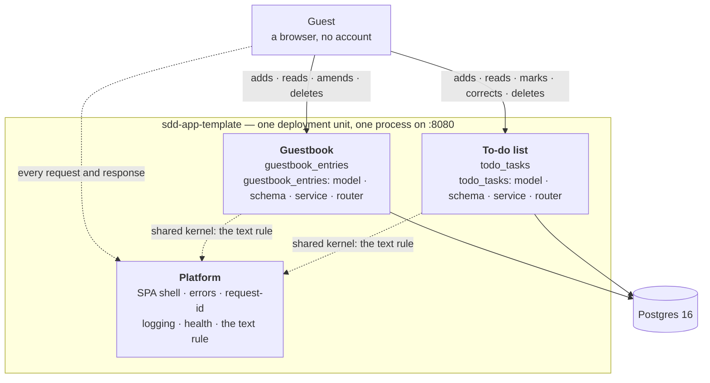
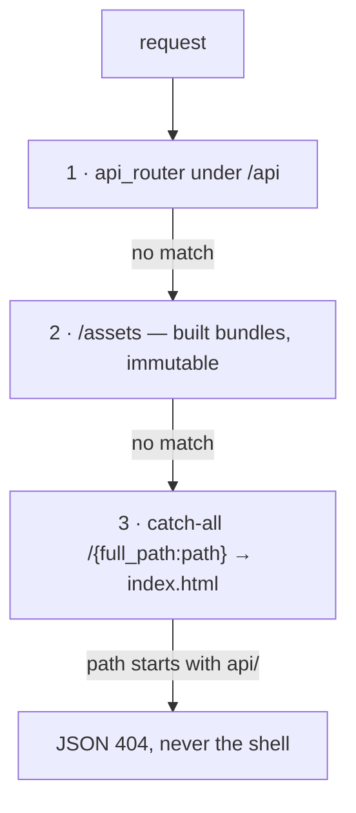

# Architecture

What this system is made of, where its boundaries run and what flows across them. Where a file
goes and what it may import is stated by [`conventions.md`](conventions.md); how the project is
run, tested and developed is stated by [`CLAUDE.md`](../../CLAUDE.md).

## What this is, and for whom

**A template for an application built by the SDD process** — with one deliberately trivial
example feature: a guestbook. A guest leaves a signed entry, entries are visible to everybody,
an entry can be amended and deleted.

Beside it stands a second feature that is **not** an example: a to-do list every visitor
shares — a task of one line, ticked done and back, corrected and deleted. It shares one rule
with the guestbook, how a text is trimmed and measured, and nothing else, so deleting the
example leaves it standing (§ Rules between contexts).

The value of this repository is the **process**, not the product: the SDD framework in
`.claude/skills/`, four test suites, the specification gates, the scripts and CI. The guestbook
exists so that every step of that process has something to show a change travelling through all
the layers on — and so that it can be deleted when the first real feature replaces it.

**There is no user authentication.** There are no accounts, sessions or roles; anybody may do
anything (the *application* logging in to the database with an IAM token is a different thing —
§ Platform). This is a named non-goal
([`../invariants.md`](../invariants.md) § Deliberate non-goals — the system-level statement,
which [`guestbook.md`](../contexts/guestbook.md) repeats for its own scope), not an absence
nobody noticed.

## Contexts and their boundaries

Two domain contexts and one supporting technical slice.

| Context | Owns | Document |
|---|---|---|
| **Guestbook** | `guestbook_entries` and the whole `P-01` flow | [`contexts/guestbook.md`](../contexts/guestbook.md) |
| **To-do list** | `todo_tasks` and the whole `P-02` flow | [`contexts/todo_list.md`](../contexts/todo_list.md) |
| **Platform** | serving the SPA, error shapes, request identifiers, logging, liveness — no domain rules | § Platform, below (`app/platform/`, over `app/core/` and `app/db/`) |



## Rules between contexts

Two domain contexts and one boundary between them. The guestbook and the to-do list are peers
joined by a **shared kernel that is the text rule alone** — normalized, trimmed, then measured
in code points — declared in both front matters and described in
[`contexts/todo_list.md`](../contexts/todo_list.md) § Neighbours. **In code the kernel belongs to
neither context:** its server half is `app/platform/schemas/text.py` and its browser half sits in
`frontend/src/lib/` beside the other rules that belong to no context (`lib/text.ts`), each
imported by both contexts. Neither context imports anything of the other, on either side of the
wire; `tests/fitness/test_context_boundaries.py` refuses it. The rules every boundary here holds:

- **A dependency points one way, is declared, and carries a classified pattern.** A context
  writing into somebody else's table imports that table's model; the context that owns a table
  never imports the model of whoever writes into it. The asymmetry is the shape of the system:
  one write path, many read paths. It is declared by `neighbours` in the front matter of a
  context document, as `<context>:<role>:<pattern>` — the direction **and** the answer to what
  happens when the other side changes. The legal pairings are in
  [`../../.specconf/templates/system/context.md`](../../.specconf/templates/system/context.md)
  § Neighbours, and `tests/fitness/test_context_declarations.py` refuses the rest.
- **A rule has one home.** A business rule and a flow live in the context document, a contract
  field in [`api.md`](api.md), a column in [`data-model.md`](data-model.md). A context document
  never lists columns; a register never argues a rule.
- **A domain constant the whole application must agree on has exactly one definition** — beside
  the model it describes. `AUTHOR_MAX_LENGTH` and `MESSAGE_MAX_LENGTH` live in
  `app/contexts/guestbook/models/guestbook_entry.py` and are imported by the schemas; a copy in a second place
  diverges on the first change. The to-do list's bound, `TODO_TASK_TEXT_MAX_LENGTH`, and its
  set of line breaks, `LINE_BREAKS`, live the same way, beside `TodoTask`.
- **A rule the database does not hold is not a rule** (constitution, article VI). Business
  uniqueness is a unique index rather than a convention: a rule enforced only in Python falls
  over on two concurrent writes. This schema has none — two guests with the same signature are
  two entries, and the same text twice is two tasks — and the absence is recorded in
  [`data-model.md`](data-model.md).

Rejected (decision of 2026-09-07, `cr: historical` — the boundary between two contexts gained
a classified pattern, which is a rule about every future context and therefore lives here;
specification-shape changes are made on the trunk and carry no `delta.md`):

- **Leave the boundary as a direction.** It was the honest minimum while there was one
  context, and it stops being honest at the second: `a writes_into b` is true of a context
  that translates `b`'s model at the seam and equally true of one that adopts it whole, and
  those two produce different code, different tests and different blast radii when `b`
  changes. The pattern is the half a reader cannot reconstruct from the arrow.
- **Record the pattern in prose, in each context's § Boundaries.** Prose is where this
  repository already keeps the reasoning, and it would have been free. It cannot be checked:
  the pairing rules — an open host service is something an upstream publishes, an
  anti-corruption layer and a conformist are the two opposite answers a downstream can give —
  are exactly the sort of thing that reads fine and is wrong, and a fitness function can only
  read a declaration.
- **Adopt the full Context Mapper vocabulary**, including `partnership` and the relationship
  qualifiers. Seven patterns already cover every boundary this template can have; a name with
  no referent is a name somebody will reach for, which is the argument
  [`../invariants.md`](../invariants.md) makes about withdrawn gate numbers.

## Containers

One deployment unit: a FastAPI application that serves a JSON API under `/api` and, from the
same process, a built React SPA. No server-side rendering — the server returns the same empty
shell for every client route, so there is no per-page HTML to keep in agreement.

| Container | What it is |
|---|---|
| Application | FastAPI + Uvicorn on `:8080` (`--port N` changes the port everywhere at once); `--development` splits this into a backend on `:8000` and Vite on `:5173` |
| Database | Postgres 16 through `docker-compose.yml` locally, Aurora Serverless v2 on AWS. One engine and only one (§ One engine, below) |
| SPA | Built assets served by the same process — `/assets/*` immutable, every other path the shell with `no-cache` |

The production image does **not** migrate at start. The migration is an explicit step
([`data-model.md`](data-model.md) § Owner of the schema).

### One engine

**The application supports PostgreSQL only.** The escape hatch to SQLite for a machine without
Docker existed and was removed in full on 2026-08-31: flags, modes, the `postgres_only` marker,
a separate migration suite, `connect_args` branches and the documentation. A machine without
Docker has **one** route: `DATABASE_URL` and `APP_TEST_DATABASE_URL` pointing at a Postgres that
machine already has. A machine with neither runs the subset that needs no database, and
`check.sh --no-docker` **names that a gap** (code 4), not green.

The reason: the target environment is Aurora Serverless v2, so "is this behaviour the same on
the other engine" stopped being a question about developer convenience and became a question
about whether a green test says anything about production. The price of a second engine was
countable: around twenty code files and ten documents maintained so that a mode could exist in
which **no test says anything about production** — including the `parseInstant` function in
`frontend/src/lib/datetime.ts`, which came about because SQLite lost the offset (it stays: the
rule "an instant without a zone is UTC" is correct regardless of who broke it).

Rejected:

- **SQLite as a "browse only" mode** — a mode in which no result may be trusted is a mode in
  which somebody will eventually trust one.
- **PGlite or `embedded-postgres`** — a real Postgres without a daemon, but a second way of
  starting a database and a new dependency, while `APP_TEST_DATABASE_URL` already solves it with
  nothing.
- **Keeping the `postgres_only` marker "just in case"** — a marker without a second engine has
  no referent, and a registered marker is a marker somebody will reach for.

The rule is held by code rather than prose: `tests/fitness/test_test_layout.py` refuses the
removed engine's name in first-party Python and refuses the marker's return. The macOS leg in CI
runs on a Homebrew Postgres — coverage after this decision **rises** rather than falls.

## The mounting order is a security property

`app/main.py` registers in this order, and **the order is load-bearing**:



The catch-all matches **every** path, `/api/...` included, and Starlette matches routes in
registration order. Registering it first would make every API call return the HTML shell with
status 200 — and the symptom is not a 404 but a frontend breaking on
`JSON.parse("<!doctype ...")`. That is why the catch-all itself raises a JSON 404 for an unknown
path under `api/`.

The `/api` prefix is applied in `app/api.py` and nowhere else. A router registered
outside that aggregate lands outside the prefix — and is swallowed.

## Platform

A slice with no domain rules. It knows about HTTP, logs and the process; it does not know what
an entry is.

| Module | Responsible for |
|---|---|
| `app/main.py` | mounting the router, the assets and the SPA shell, in that order |
| `app/core/errors.py` | three handlers — `HTTPException`, `RequestValidationError`, catch-all — and `CatchAllMiddleware`, which is where the catch-all actually runs. The record carries the exception's **type and position**, the body is **fixed**, and the exception's text reaches neither. The middleware sits **inside** the two header wrappers, so a 500 leaves stamped like every other response; Starlette's own `ServerErrorMiddleware` is built outside them and answers through the raw `send`, which is why catching it there alone was not enough |
| `app/core/request_id.py` | the request identifier in a contextvar, set before anything that logs — and **not reset when a request fails**, because `ServerErrorMiddleware` is built outside it and logs the failure afterwards |
| `app/core/logging_config.py` | the shape of a log line; configured at import, so the process's first record is already shaped. It also **holds article XI over the whole record**: `ExceptionSummaryFilter` sits on every sink and reduces any exception — `exc_info`, `args`, `msg` — to its type and its frames, which is the only placement that also covers `uvicorn.error`, `asyncio` and SQLAlchemy's own `exc_info=True` sites |
| `app/platform/routers/health.py` | liveness — it does not touch the database, because the image starts before the database is reachable |
| `app/db/session.py` | the engine and the session factory; it **neither creates nor migrates the schema**. `hide_parameters=True` is recorded there as surface reduction rather than as the rule — it shortens `StatementError` and reaches neither the driver's own message nor the cause chain |
| `app/db/iam_auth.py` | logging in to the database with a locally signed IAM token — no password, no route to Secrets Manager; enabled by `DB_IAM_AUTH`, inactive outside AWS |
| `app/lambda_handler.py` | two Lambda entry points from one package: `handler` (Mangum over `app/main.py`) and `migrate` (a release step, under the master user) |

Rejected (decision of 2026-09-16, `cr: historical` — article XI moved from a convention the call
sites kept to a rule a filter holds, which is a statement about every record this application will
ever emit and therefore lives here; the repair was made on the trunk and carries no `delta.md`):

- **Fix the one `logger.exception` in `app/core/errors.py`.** It is the call site the audit
  points at and the smallest possible edit. It closes one of the emission paths. Starlette's
  `ServerErrorMiddleware` re-raises after the handler has answered, so under uvicorn the same
  exception is logged a second time by `uvicorn.error` — which this module deliberately routes
  into the same sinks — and `asyncio` and SQLAlchemy log their own exceptions through loggers
  that never reach `errors.py` at all. An edit at a call site cannot reach a record another
  library emits, and the count of such call sites is not fixed.
- **Put the filter on the loggers rather than on the handlers.** It reads as the more precise
  placement and it is the wrong one: a logger's filters run only for records logged *through*
  that logger, never for records propagated up from a child. `uvicorn.error` is configured with
  `handlers: []` and `propagate: True` precisely so that its records travel to the root
  handlers, and a filter on a logger would have missed every one of them.
- **Drop the traceback and log the exception's type alone.** It is unarguably safe and it
  removes the half of the record an operator actually navigates by. The summary keeps the
  frames — file, line and qualified function, for the whole cause chain — and drops only the
  text, because a position is not a value and `docs/runbooks/incident-first-response.md` tells
  a first responder to follow exactly that.
- **Rely on `hide_parameters=True`.** SQLAlchemy's own documentation scopes it to one section
  of one exception type of one engine. It does not touch `DBAPIError.orig`, so Postgres's
  `DETAIL: Key (author)=(…)` survives it; it does not touch the cause chain; and Pydantic's
  `input_value='…'` was never in its reach. It is set, in `app/db/session.py`, as surface
  reduction — recorded there as such so that a later reader does not mistake it for the rule.

Rejected (decision of 2026-09-16, `cr: historical` — where the layer that catches an unhandled
exception sits is a statement about every response this application will ever fail with, and
about two headers two documents under `docs/` promise without exception; the repair was made on
the trunk and carries no `delta.md`):

- **Stamp the two headers inside `_handle_generic_exception`.** It is the smallest edit and it
  reaches the response that is actually going out. It also moves the `X-Robots-Tag` decision out
  of `app/main.py`, where `app/core/robots.py` puts it and where `tests/unit/test_robots.py`
  reads the source to keep it — so stage and production would be answering `noindex` the first
  time somebody crashed a route there. A header whose condition is written in two places has two
  conditions.
- **Make `ServerErrorMiddleware` send through the wrappers.** There is no seam: FastAPI composes
  the stack as `[ServerErrorMiddleware] + user_middleware + [ExceptionMiddleware]`, and the outer
  layer closes over the server's own `send` before any of ours exists. Wrapping the whole
  application object afterwards would work, and would stop `app` being a `FastAPI` — which
  `app.openapi()`, the test client and `Mangum` all depend on.
- **Register the catch-all on `BaseException` instead of `Exception`.** It works, and for an
  obscure reason: FastAPI lifts only the literal `Exception` key out to the outer layer, while
  Starlette's handler lookup walks the exception's MRO — so the handler would be found by
  `ExceptionMiddleware`, which is already inside both wrappers. It would also stop covering an
  exception raised by a middleware, and it would rest on an implementation detail no
  documentation promises.
- **Let the new middleware swallow the exception rather than re-raise it.** One fewer log record,
  and the response is complete by then, so nothing is lost on the wire. What is lost is every
  *accidental* server error in the test suite: the shared client runs with
  `raise_server_exceptions=True` and would report a 500 instead of the traceback that says which
  line raised. The duplicate record is closed instead by a per-request flag on the ASGI scope,
  which is exact — the second handler falls silent precisely when the first one has already
  written.

## Deployment — two artefacts from one source

This application runs in two ways and **there are not two code paths**. The difference is in
what the artefact contains, not in how the code behaves: `app/main.py` mounts the static files
if and only if the `app/static/assets` directory exists. No module under `app/` asks whether it
is running in Lambda, apart from the connection pool in `app/db/session.py` — and that is a
property of the runtime, not of the application.

| Artefact | Who uses it | What it contains | What builds it |
|---|---|---|---|
| Docker image | locally, in-house, the CI smoke | backend + the built SPA, one process | `Dockerfile` |
| Lambda zip | AWS | the backend and its dependencies only, without `app/static` | `scripts/package.sh` |

### The shape on AWS

```
                    ┌───────────── CloudFront (one domain) ──────────────┐
   browser ───────▶ │  /api/*  ──▶ API Gateway ──▶ Lambda (zip, arm64)   │
                    │  /*      ──▶ S3 (private, OAC) + fallback → index  │
                    └───────────────────────────────────────────────────┘
                                                  │ VPC, 2 AZ, NO NAT
                                                  ▼
                            [RDS Proxy] ──▶ Aurora Serverless v2 (Postgres 16)
                            (stage/prod)          min 0 ACU
```

Four properties, each of which was a decision:

- **One domain for the screen and for the API**, so requests are same-origin and there is still
  no CORS anywhere. This is the same property one process buys locally — moved, not abandoned.
- **API Gateway, not a Lambda Function URL.** CloudFront OAC signs requests to a Function URL
  **without the body**, and this application writes with the body. Such an arrangement passes
  every read and fails on the first write, through the CDN alone.
- **No NAT gateway.** The function reaches for one thing and that thing is in the same VPC.
  `app/db/iam_auth.py` pays for it: an IAM token signed locally, with no route to Secrets
  Manager.
- **The migration is a release step**, not a start-up step — the same zip carries a second
  handler (`app/lambda_handler.py`), and `scripts/deploy.sh` calls it **before** switching the
  code over. A container that migrates at start races every other replica, and Lambda can start
  a hundred at once.
- **The switch is an alias, not the apply.** For a long time the sentence above was a claim the
  code did not keep: `terraform apply` calls `UpdateFunctionCode`, so the new code was serving
  from step 2 while the migration was step 3 — new code over an old schema, which is the exact
  window the ordering exists to close. So the API function is `publish = true` and the gateway
  routes to an alias Terraform creates and never moves
  (`infra/terraform/modules/api/main.tf`); `deploy.sh` moves it with one `update-alias` **after**
  the migration returns. A migration that fails now leaves the previous version serving over the
  schema it was built for, which is what the failure message already promised. The migration
  function is deliberately not aliased — it has to be the new code.

**A zip rather than an image in Lambda**, because a zip is what Lambda supports best: a smaller
artefact, a faster cold start, and SnapStart, which does not work with images. The API function
holds no password — it signs an IAM token locally (`app/db/iam_auth.py`); the migration function
does have one, because it executes DDL, and it is what grants the API role its login.

Rejected (decision of 2026-08-31):

- **Leave the SPA in Lambda** — zero changes and zero CORS, but every request for an icon wakes
  the function and pays for milliseconds; a CDN exists for exactly this.
- **S3 on its own domain, the API on another** — CORS comes back, along with preflight and the
  question of whether a cookie is third-party, for an application that never had that question.
- **App Runner or ECS Fargate** — simpler than Lambda and **not serverless**: you pay for an
  instance that waits.
- **A container image in Lambda** — one artefact instead of two, a worse cold start and no
  SnapStart. To be reconsidered when the zip stops fitting in 250 MB.
- **AWS Lambda Web Adapter instead of Mangum** — it works as a layer over an image, which forces
  the choice rejected above.

Consequences: the two artefacts can diverge — one source, one commit and a CI that builds both
defend against it (`tests/tooling/test_lambda_package.py` holds what goes into the zip);
`app/static/` does **not** travel to Lambda, because two copies of the SPA behind one
distribution are two answers to the question of what the browser gets; a cold start plus waking
the database at `min_capacity = 0` fit inside the 30-second timeout — and that is the reason
this timeout is what it is rather than the default.

### Environments

Two long-lived environments and any number of ephemeral ones, and the difference between
them is the whole design.

`infra/terraform/envs/{stage,prod}/` — a long-lived environment is a **directory**, not a
workspace. Everything is shared except the differences: `modules/stack/` assembles four
modules into one environment, and an environment's directory is about twenty lines
containing **only what makes that environment different from the other**. What differs
and what each costs at rest: [`infra/README.md`](../../infra/README.md).

`infra/terraform/preview/` is the other half. `shared/` holds one VPC and one Aurora
cluster, applied once per account; `branch/` is a template root applied once per branch,
against a state key supplied at `init`. A branch's preview is a Lambda, a public Function
URL and a database on the shared cluster — about ninety seconds to raise and thirty to
drop, against fifteen to twenty minutes each way for a full stack. `scripts/preview.sh`
is the interface; `.github/workflows/preview.yml` and `preview-teardown.yml` are what
call it.

Six rulings, the first three from 2026-08-31 and the rest from 2026-09-04:

- **Terraform**, because `terraform plan` is a readable review artefact: it says what will change
  before it changes, and for resources whose destruction is irreversible (the database, the state
  bucket) that separates a change reviewed from a change performed. The cost: a pinned binary
  (`TERRAFORM_VERSION` in `scripts/_lib.sh` — two versions write two state formats, and the newer
  one cannot be read by the older) and a one-off bootstrap of the state backend. Rejected: AWS CDK
  (CloudFormation underneath, with a worse preview of changes), AWS SAM (the shortest route to
  Lambda alone; CloudFront, S3 and Aurora still have to be written in raw CloudFormation).
- **A directory, not a workspace**, for anything long-lived, because a directory is visible in a
  diff and in code review, while a workspace is a flag that can be got wrong — a `terraform apply`
  aimed at the wrong environment is a mistake cleaned up by hand. Rejected: workspaces, and one
  directory with `-var-file` (both move the difference between environments into a call argument);
  a separate AWS account per environment (the right boundary for an organisation this project does
  not have — it can be added later, because the state key is per environment anyway). The price:
  two directories can diverge, and the one that diverges is the one nobody deploys often enough —
  which is why `tests/fitness/test_infra_layout.py` holds them.
- **Deployment through OIDC**, with no long-lived key: the workflows take a short-lived token and a
  role protected by a **trust policy**. The role has `AdministratorAccess` and
  `infra/README.md` says so outright: a policy narrowed badly fails in the middle of an `apply`.
- **A preview shares the expensive half**, rather than being a copy of the account. One VPC and one
  Aurora cluster serve every branch, and a branch gets a database on that cluster. The reason is
  arithmetic rather than taste: an account has **five VPCs per region**, so a VPC per branch is
  exhausted at the second live preview; an Aurora cluster is minutes to create and minutes to
  destroy; and a destroyed master secret holds its own name for a recovery window, so the same
  branch could not be redeployed inside it. Rejected: a full stack per branch (the above); a schema
  per branch inside one database (cheaper still, but migrations then share a schema search path and
  a failed preview can corrupt another's). The price: previews share a connection budget, and one
  cluster is a single point of failure for all of them — acceptable for something disposable.
- **A preview serves the SPA from its own function**, so it has no S3 bucket and no CloudFront
  distribution. A distribution is minutes to create and longer to delete, and a bucket name is
  globally unique — both wrong shapes for something created per branch. This is a deliberate,
  named exception to § Deployment's rule that the SPA does not travel to Lambda, and it is carried
  by a **second artefact** (`.sdd/build/lambda-preview.zip`) rather than by a flag, so stage and
  production keep receiving exactly the package they received before previews existed. Its
  entrypoint is a **Lambda Function URL** rather than an API Gateway: two resources instead of six,
  no propagation wait, no request charge, and no 29-second ceiling in front of a cluster that has
  to wake up. The price: the URL is public and unauthenticated, so a preview answers `noindex` on
  every response (`app/core/robots.py`) and is expected to be short-lived.
- **Only GitHub deploys**, and it is a control rather than a convention. No human-assumable role
  carries write permissions: the deploy and preview roles trust GitHub's OIDC provider alone, and
  people get a separate read-only role for `plan`. `scripts/deploy.sh` refuses to run outside
  Actions, which is a signpost rather than the control — the control is that a workstation has no
  credentials with which to ignore it. Break-glass is an account admin attaching a policy to
  themselves, which CloudTrail records; it is deliberately not a shell flag, which records nothing.

The bootstrap keeps its state locally (the state bucket cannot store its own), and the bucket name
is copied by hand into every root's `backend.tf`, because a `backend` block takes no variables.
`infra/terraform/preview/branch/backend.tf` is the one that carries no `key` at all: every preview
would otherwise share one state file, and the second branch to deploy would take over the first
one's stack.
`check.sh` has an `Infrastructure` gate (`fmt -check` and `validate`, with no credentials and no
state — deliberately **not** `plan`, because a plan is a question about an account, not about a
commit).

### What a new environment starts with

**An environment is infrastructure plus an initial state, and the second half used to be
written down nowhere.** A preview whose guest book or to-do list is empty is a preview of a
screen nobody can judge, so every list that comes up empty is filled from
[`golden-set/seed/`](../../golden-set/seed/) — the half of the reference corpus that exists to
be looked at, as against `golden-set/fixtures/`, which the suites assert about
([`testing.md`](testing.md) § The reference corpus). **Each list is filled on its own:** the
guest book gets its welcome entries when it holds none, whatever the to-do list holds, and the
to-do list gets its example tasks when it holds none, whatever the guest book holds.

`scripts/seed.sh` is the whole interface, and `start.sh`, `preview.sh` and `deploy.sh` all call
it rather than the Python behind it: one definition of "seed an environment" instead of three
that drift (constitution, article XII). It applies to a fresh clone exactly as it applies to a
preview, because "an environment nobody has written in yet" is one condition and not two.

**Through the application's own HTTP API, never into the database.** A seeder writing rows
directly would be a second implementation of `BR-01` — or of `BR-06`…`BR-08` for a task — would
drift from the service the moment a rule changed, and could plant data the application itself
would have refused. Posting means the corpus arrives the way a guest's entry arrives, or does
not arrive at all — and it means the seed data is bound by the same limits as everything else
that reaches the database ([`data-model.md`](data-model.md) § `guestbook_entries`). A task
arrives the way a person's does: added, and therefore not done, then marked through the
marking route when the corpus says it is done — so an example shown done got there the way any
task does, never born done (`BR-08`).

**Two refusals, and they are what make it safe to run unconditionally:**

- **It will not seed production.** It asks `/api/health`, which reports the environment
  Terraform gave the deployment — the deployment's own answer rather than something inferred
  from a URL. Test data in production cannot be undone by hand once a real visitor has replied
  to it.
- **It will not seed a list that already holds something** — a guest book with entries, a
  to-do list with tasks — and it asks each list on its own, so one list's state never decides
  the other's. So "seed every new environment" and "run on every deploy" are one instruction,
  and every run after the first costs one `GET` per list.

Neither refusal depends on a caller passing the right flag, which is what would fail the first
time somebody added a caller. Failing to seed is a warning and not a failure: the environment
came up, and a corpus that did not arrive is a thing to notice rather than a thing to roll
back.

**The black box is the exception, and it is an exception by design.** The e2e suite truncates
the world before every scenario, so it and seed data cannot share an environment; `test.sh`
starts the application with `--no-seed`, and the harness refuses to reset any database that
does not say, in itself, that this run may empty it — a `COMMENT ON DATABASE` carrying the
run's id, which `test.sh e2e` writes on the database it provisioned and refuses to write on
one somebody else supplied unless `E2E_ALLOW_REMOTE_RESET` names it.

Rejected (decision of 2026-09-05, `cr: historical` — taken outside `/sdd`, so it is recorded
here rather than in `spec/ADR/`, for the reason [`conventions.md`](conventions.md) § When a
decision is an ADR gives):

- **One corpus for both jobs**, which is what stood until this date. The seeder posted
  `entries-ordinary.json` on the argument that a reviewer should look at the very data the
  assertions are written about. It does not hold: the fixture half is sized by what a test must
  prove and the seed half by what a person must see, so an entry added for the second weakened
  a paging test that counted them, and a boundary case added for the first put an
  eighty-character signature on the screen. The properties that made the argument attractive —
  characters outside ASCII, a message with line breaks — are cheap to keep on both sides, and
  are now owed by each half in its own right.
- **A second locator for the second half.** `tests/_golden_set.py` once had a hand-copied twin,
  and the copies diverged in return type and in exception type before anybody noticed. The
  split is therefore two directories under one locator, never two modules.
- **Seeding by writing rows.** Faster, and it would be a second implementation of `BR-01` that
  drifts from the service on the first rule change — and it could plant data the application
  itself would refuse.
- **Seeding from a migration.** `alembic/versions/` owns the schema and only the schema
  ([`data-model.md`](data-model.md) § Owner of the schema); data in a revision makes every
  environment that runs it carry the example, production included.
- **No seed data at all, and a note in the README telling a reviewer to type some.** That is
  what a preview costs today measured against what it is for: a screen nobody can judge.

The price, stated: two files to keep honest instead of one, and a rule — no suite may read the
seed half — that is a fitness function rather than a convention, because it was rediscovered
rather than foreseen.

**What the black box's exception rests on** was, until 2026-09-16, the connection string: the
harness read `host` out of it and refused anything that was not `localhost`. That is a statement
about text rather than about a database, and four things walked past it — `hostaddr`, which
libpq honours over `host`; a string with no address at all, which libpq fills from `PGHOST` or
`PGHOSTADDR`; `service=`, which names a file this process never reads; and an opt-in compared
for truthiness, so `E2E_ALLOW_REMOTE_RESET=0` switched the protection off. None of the four is
the real point. The real point is that "local" was never "disposable": a tunnel to a shared
database answers on `127.0.0.1` and carries this application's tables, so the thing being
checked could not have decided the question even when it was read correctly.

Rejected (decision of 2026-09-16, `cr: historical` — taken outside `/sdd` and recorded here
rather than in `spec/ADR/`, for the reason [`conventions.md`](conventions.md) § When a decision
is an ADR gives):

- **Reading the address harder.** Parsing `hostaddr`, refusing `service=`, scrubbing `PG*` —
  all of it is now done, and none of it is the guard. It narrows which string can lie; it
  cannot make an address into evidence of ownership. It is kept as the cheap first refusal,
  because a target nobody can locate should fail before a connection opens.
- **Asking the server where it is** — `inet_server_addr()` settles `host` / `hostaddr` /
  `service` / `PG*` at the source, and still answers `127.0.0.1` at the end of a tunnel. It is
  read, and it is material for the refusal message so a reader is told which database was
  reached; it decides nothing.
- **A marker table**, written outside Alembic or shipped in a revision. The first puts a table
  in the schema behind the one tool that owns it ([`data-model.md`](data-model.md) § Owner of
  the schema); the second puts an `e2e_disposable` table in production, which is an invitation
  rather than a guard.
- **A database per run**, created and dropped by `test.sh`. The strongest form, and it is the
  one thing that would have to override a `DATABASE_URL` somebody set — which `scripts/_lib.sh`
  refuses to do on the grounds that it may name a database holding real data. Refusing to run
  is the weaker guarantee and the honest one: the URL is honoured, or the run stops.
- **Treating `REQUIRED_TABLES` as the permission.** It is a sanity check. A shared staging
  database has `guestbook_entries` too.

## What a new feature adds

The path the guestbook took, and the same one your first feature will take. Everything domain
sits under the context that owns it; `<context>` is the same word in all four trees, and that
sameness **is** the link — there is no mapping file to keep current
([`conventions.md`](conventions.md) § Backend — where a file goes).

| Layer | File |
|---|---|
| Model | `app/contexts/<context>/models/<concept>.py` — one class per file |
| Schema | `app/contexts/<context>/schemas/<concepts>.py` — separate read and write shapes |
| Service | `app/contexts/<context>/services/<concepts>.py` — rules, the transaction, domain exceptions, **no `fastapi`** |
| Router | `app/contexts/<context>/routers/<concepts>.py` + one line in `app/api.py` |
| Public API | `app/contexts/<context>/__init__.py` — what a neighbouring context may import, and the only thing it may |
| Migration | `alembic/versions/` — the parent is the head at the time of implementation |
| Screen | `frontend/src/contexts/<context>/pages/<Name>Page.tsx` + a constant in `frontend/src/routes.ts` + a route in `frontend/src/router.tsx` |
| Specification | `spec/contexts/<context>.md` + entries in `api.md` and `data-model.md` |
| Contract | `contracts/openapi/<context>.yaml` |
| Ownership | one line in [`../../.github/CODEOWNERS`](../../.github/CODEOWNERS), which is the point of the whole shape |
| Proof | a unit test, an integration test and a `.feature` scenario |

A **second** context adds nothing to that list and takes nothing from it. That is the property
this layout was chosen for, and the to-do list is what it looks like in practice: the files two
contexts share are `app/api.py`, `app/contexts/__init__.py`, `frontend/src/routes.ts` and
`frontend/src/router.tsx`, and each of those takes exactly one appended line per context, so two
people working on two contexts meet in four places and git's ordinary text merge settles all
four. Two more meet a context only when it has what they serve, and neither is a context's file:
the frame, `frontend/src/components/shell/PageFrame.tsx`, which carries one way to each screen
(it learned the way between screens with the second one), and the seeder,
`scripts/seed_golden_set.py` with the corpus locator `tests/_golden_set.py`, which fills each
list a new environment opens with on its own.

Rejected (decision of 2026-09-07, `cr: historical` — the tree was recut from layers to bounded
contexts; this is the document that describes what the system is made of, and the placement
rule that follows from it is in [`conventions.md`](conventions.md) § Backend — where a file
goes. The recut was done on the trunk and carries no `delta.md` in which to declare the edit):

- **Keep the layer-first tree** — four layer directories sitting directly under `app/`, one
  file per concept in each. It is the idiomatic FastAPI layout, the guestbook fitted it, and nothing about it was wrong
  for one context. It fails at exactly one thing, and that thing is why this changed:
  `.github/CODEOWNERS` matches **paths**, so a layer-first tree can hand somebody every
  context's `services/` and can never hand them one context. Ownership is the unit sdd107 puts
  first — before hierarchy, before any drift detector — and it was the one unit this repository
  could not express.
- **Cut by context and drop the layers inside it**, one flat directory per context. Shorter
  paths, and it deletes the rule this repository calls the one above all the others: one file
  per layer, named after the concept. A context with five concepts becomes twenty files in one
  directory, and `tests/fitness/test_layering.py` loses the directory it reads.
- **Discover the contexts instead of listing them** in `app/api.py` and
  `app/contexts/__init__.py`. It removes the only three files two contexts share. It also
  removes the ability to ask the question in both directions — with a list, a context nobody
  registered is exactly as loud as a registration with no context, and a walk can only ever
  answer the second. The three files take one appended line each, which git merges.
- **Move `app/core/` and `app/db/` under `app/platform/`** so that Platform is one directory.
  It would make the tree match this document's Contexts table exactly. It also says something
  untrue: those modules are used by Platform and by every context alike, and filing them under
  one slice's name makes a shared thing look owned.
- **Wait for the second context.** sdd107 says outright that this topology is overkill below
  two teams, and that is a fair reading of today. It was rejected because the cost is not
  symmetrical: recutting an empty tree is an afternoon, and recutting a tree with two contexts
  in it means moving somebody else's work while they are writing it.

## The to-do list — where each rule lives

The second context, laid out exactly as § What a new feature adds describes, under the one word
`todo_list` in every tree. Its rules are [`contexts/todo_list.md`](../contexts/todo_list.md); its
columns and the shape of every write are [`data-model.md`](data-model.md) § `todo_tasks`; its
routes, shapes and refusals are [`api.md`](api.md). This section says which layer holds each
rule, which file holds each layer, and which implementer writes each file.

### The layer per rule

| Rule | Where it is held | Why that layer |
|---|---|---|
| `BR-06` — a task needs text, at most 200 code points | the context's `services/todo_tasks.py`, which judges the text before any write (normalize, then empty, then one line, then measure) and raises one domain exception per verdict; the bound, `TODO_TASK_TEXT_MAX_LENGTH`, beside `TodoTask` in `models/`; the browser's copy in the context's `lib/` | a business rule is decided in `services/` (`conventions.md` § Layers); a constraint in the schema would answer with FastAPI's list and no code ([`api.md`](api.md) § Shapes, `TodoTaskCreate`) |
| `BR-07` — a task is one line | the same judgement in the service, after the empty check and before the measurement; `LINE_BREAKS` beside `TodoTask`; the browser's copy beside the browser's bound | its precedence over `BR-06` — a text both too long and on two lines is refused as two lines — is one sequence, and it is one sequence because the schema carries no length bound to answer first |
| `BR-08` — a new task is not done, and its moment of adding is set once | the service's add, which writes `done` false and `created_at` from its own clock on every insert; the create shape carries the text alone | the service owns the write and the clock, so nothing a caller sends reaches either column |
| `BR-09` — marking records the chosen state | the service's mark: one statement naming `done` alone, carrying the value the person chose | the store holds it through the statement's shape ([`data-model.md`](data-model.md) § Two writers on one task), and only the service writes |
| `BR-10` — the text and the state change separately | the service's correction: one statement naming `text` alone; the add and the correction share the one judgement in the service | the same statement shape; one judgement for both is what makes "a correction is held to `BR-06` and `BR-07` exactly as an addition is" true by construction rather than by care |
| `BR-11` — one order, total, with no pages | the service's read: every row, by `created_at` then `id`, both descending; the index in the model and in the revision | the order is a rule, and the service is where a rule meets the store |
| `BR-12` — the same text twice is two tasks | nowhere, deliberately: no layer holds a uniqueness check | a rule that forbids nothing needs no holder, and a unique index would be the defect |
| `BR-13` — deletion is permanent; a task that is gone stays gone | the service raises `TodoTaskNotFoundError` when a statement returns no row, and never writes on absence; the router turns it into the not-found refusal | a service never names a status code (`conventions.md` § Layers), and the sentence belongs beside the endpoint that produces it |
| The way between the two screens, the main address, the not-found page | the frame and the composition root: `frontend/src/components/shell/PageFrame.tsx`, `frontend/src/routes.ts`, `frontend/src/router.tsx`, `frontend/src/pages/StatusPages.tsx` | no context owns them ([`contexts/todo_list.md`](../contexts/todo_list.md) § Neighbours); the frame is the one file that learns about a second screen ([`ui/system-states.md`](ui/system-states.md) § One column) |
| A change not stored is never shown as made; a list that failed to load is not an empty list | the context's query hook, which writes its cache only from the server's answer and never ahead of it; the page tells a failed load from an empty list | the hook is the one place the cache is written (`conventions.md` § Frontend), so it is the one place a change could be shown before it was stored |
| Example tasks in a new environment | the seeder, `scripts/seed_golden_set.py`, and one file in `golden-set/seed/` | § What a new environment starts with |

The router decides nothing on that list. It binds the routes [`api.md`](api.md) publishes,
declares every refusal it can answer with, and turns each of the service's domain exceptions
into its coded refusal, explicitly: the not-found refusal and the three about a task's text,
with the sentences [`api.md`](api.md) § The to-do list's refusals gives. It answers
`todo_task_empty_patch` itself, before it calls the service, as the guestbook's router answers
its empty patch.

### The files

Paths in the second column are relative to the tree in the first.

| Tree | File | Holds | Written by |
|---|---|---|---|
| `app/contexts/` | `todo_list/__init__.py` | the context's public API — `TodoTask`, the bound, `LINE_BREAKS` — and, by importing the model, `todo_tasks` on the shared `Base` | build-backend |
| | `todo_list/models/todo_task.py` | `TodoTask`, `TODO_TASK_TEXT_MAX_LENGTH`, `LINE_BREAKS` written as code-point numbers the way the trim set is, and the ordering index | build-backend |
| | `todo_list/schemas/todo_tasks.py` | no text rule, only the read and write shapes [`api.md`](api.md) names, read and write kept apart | build-backend |
| | `todo_list/services/todo_tasks.py` | add, read, correct, mark and delete; the session and the transaction; `TodoTaskNotFoundError`, and the text's judgement with its three domain exceptions | build-backend |
| | `todo_list/routers/todo_tasks.py` | the HTTP binding of every to-do route, the declared refusals and their sentences | build-backend |
| | `todo_list/{models,schemas,services,routers}/__init__.py` | each layer's docstring, as the guestbook's say it | build-backend |
| | `__init__.py` | one appended line registering `todo_list` | build-backend |
| `app/` | `api.py` | one appended line mounting the to-do router | build-backend |
| `alembic/versions/` | the revision that creates `todo_tasks` | its ordered operations are [`data-model.md`](data-model.md) § The revision that creates `todo_tasks` | build-migration |
| `frontend/src/` | `contexts/todo_list/pages/TodoListPage.tsx` | the screen: the field, the list, and its loading, empty and failed states | build-frontend |
| | `contexts/todo_list/components/TodoTaskComposer.tsx` | the one field and its verdict before sending, with no attribute that stops input at a bound | build-frontend |
| | `contexts/todo_list/components/TodoTaskRow.tsx` | one task: its done control, its text drawn done or not done, its correction in place, its delete | build-frontend |
| | `contexts/todo_list/components/DeleteTodoTaskDialog.tsx` | the one question before a delete, over the `Modal` primitive | build-frontend |
| | `contexts/todo_list/hooks/useTodoTasks.ts` | the resource's query and its four mutations, `todoTaskKeys`, the cache written only from answers | build-frontend |
| | `contexts/todo_list/lib/todoTask.ts` | the `TodoTask` type, the browser copies of the bound and of `LINE_BREAKS`, the verdict in the order `BR-07` then `BR-06`, and its sentences | build-frontend |
| | `lib/text.ts` | the shared text rule's browser half, moved up out of the guestbook's `lib/` (where it was `entryText.ts`) because a second context needs it — the move `conventions.md` § Frontend prescribes for that day | build-frontend |
| | `contexts/guestbook/lib/guestbookEntry.ts`, `contexts/guestbook/components/EntryComposer.tsx`, `contexts/guestbook/hooks/useEntryQueryParams.ts` | the same three imports of the text rule, from its new home; nothing else about the guestbook moves | build-frontend |
| | `components/ui/Checkbox.tsx` | the done control: a design-system primitive, with its first caller | build-frontend |
| | `components/shell/PageFrame.tsx` | the way between the two screens, and the frame's words for two of them | build-frontend |
| | `pages/StatusPages.tsx` | a not-found page that no longer says there is one screen | build-frontend |
| | `routes.ts`, `router.tsx` | one constant, one route; the main address still leads to the guestbook | build-frontend |
| | `api/schema.d.ts` | regenerated by `./scripts/generate.sh`, never edited | build-frontend |
| `golden-set/seed/` | `todo-tasks-example.json` | the example tasks, each under 150 code points, at least one marked done | build-backend |
| `scripts/` | `seed_golden_set.py`, `seed.sh` | filling each list on its own, and saying so in `--help` | build-backend |
| `.github/` | `CODEOWNERS` | the context's rows, in the file's own per-context pattern | build-platform |

No test is in any row above. The tests are written first, by their own authors — `tests/`,
`e2e/`, and the `*.test.ts` and `*.test.tsx` files beside each frontend module — and which suite
proves which rule is [`testing.md`](testing.md).

### Who writes what, and where the sets meet

The four builders run beside each other, and their sets are disjoint because the layout makes
them so (`.specconf/stack.json` § `skills`): build-backend holds `app/`, `scripts/` and
`golden-set/seed/`; build-migration `alembic/versions/`; build-frontend the modules of
`frontend/src/`; build-platform `.github/` and the other trees that run the application. For
the files above, pairwise:

- backend ∩ frontend = ∅ — no file is both under `app/`, `scripts/` or `golden-set/seed/` and
  under `frontend/src/`;
- backend ∩ migration = ∅ — the revision is the only file under `alembic/versions/`, and the
  model it mirrors is under `app/`;
- backend ∩ platform = ∅, frontend ∩ migration = ∅, frontend ∩ platform = ∅,
  migration ∩ platform = ∅ — `CODEOWNERS` is the platform's one file.

**The intersection is empty.** One prefix is held by two members — `frontend/src/`, by
build-frontend and by the frontend test author — and it is cut by the shape of the file rather
than by directory: every file in build-frontend's rows is a module, and everything the test
author writes there is `*.test.ts` or `*.test.tsx`. The test authors' sets are disjoint from one
another and from every builder's in the same way: `tests/unit/` with `tests/fitness/`;
`tests/integration/`, `tests/tooling/`, `tests/_golden_set.py` and `golden-set/fixtures/`; the
vitest files; `e2e/`.

**[`testing.md`](testing.md) decides which files a test author writes, and the change's boundary
names every one of them.** The trees above say where each test author may write, not which
files it writes. The testing document decides the files. The change's table of the paths it
owns (§ This change owns in its architecture fragment, from which the boundary is recorded)
covers each of those files by path or by a row that holds it, even when both documents are
written in the same wave. For the to-do list that includes **frontend/src/router.test.tsx**,
build-tests-frontend's vitest cases for the to-do list's own address, the main address and an
unknown address (`CR-2609-823a/R-5`). It sits beside the composition root it proves, outside
every context folder, so no row that names a folder holds it. The user decided it in
`CR-2609-823a` (`Q-18`) in these words: "Add the file to the change's list."

**Disjoint is not independent.** Three edges cross the sets, and none of them is a shared file:

1. `schema.d.ts` is generated from build-backend's schemas and routers, so build-frontend
   regenerates it only once they exist — the one file in the builders' wave that waits on
   another builder's output.
2. The seeder imports the corpus locator, and the locator names the seed file build-backend
   writes. The locator is written first, in the test wave, and reads red until the file exists.
3. The revision and the model describe one table from two trees. Neither imports the other, and
   `tests/integration/test_migrations.py` compares them.

### What holds the boundaries

| What may not happen | What refuses it |
|---|---|
| a module of either context imports the other context, on either side of the wire | `tests/fitness/test_context_boundaries.py` — `test_no_context_imports_another_contexts_internals` and `test_no_screen_reaches_into_another_contexts_folder` |
| anything but `app/api.py` reaches the to-do router module | the same file, `test_only_the_composition_root_reaches_a_contexts_wiring` |
| the context is registered in one aggregate and not the other, or has a document and no code | the same file, `test_every_context_directory_is_registered_and_every_registration_exists` and `test_every_context_document_has_code_and_every_context_directory_has_a_document` |
| `services/`, `models/` or `schemas/` import `fastapi` or `starlette`; a lower layer imports an upper one; a router reaches for the session | `tests/fitness/test_layering.py` |
| a browser copy of the bound or of the line-break set drifts from its home | `tests/fitness/test_length_constants.py`, which holds each constant equal to its one browser copy |
| a second module in `frontend/src/` reads the text-measurement corpus | `tests/fitness/test_golden_set.py`, `test_the_frontend_reads_no_corpus_file` |
| a suite reads the example tasks | `tests/fitness/test_golden_set.py`, `test_no_suite_reads_the_seed_corpus` |

## When a context outgrows this shape

Two thresholds, written down because a threshold nobody wrote is not a decision anybody took —
it is a question that gets answered by whoever is in a hurry. Both say **not yet** about this
template today, and both say what would change that.

### When a context deserves its own deployable

**Never merge two contexts into one service, and never assume one context needs more than
one.** A bounded context marks the boundary of the biggest service that can sensibly exist; a
service is a context or a piece of one, never a bag of two. So the question is only ever
whether to split one *out*, and the answers that count are about the runtime rather than the
code:

- it has to **scale on a different axis** from the rest — a read-heavy context behind a
  write-heavy one, or the other way round;
- it has to be **released on a different cadence**, because its consumers are not this
  application's consumers;
- it carries a **different availability or regulatory obligation**, so that failing together
  with everything else is itself the defect;
- it is written in something else, for a reason that survives being said out loud.

**A directory that has grown large is not on that list.** Size is what the layering inside a
context is for. Splitting on size buys a network call, a second deployment, a second failure
mode and an integration pattern to maintain, in exchange for a directory listing that fits on
a screen.

Until one of those four holds, a context is a directory in this one process, and the
[`../invariants.md`](../invariants.md) rule applies: the absence is a decision, not a gap.

### When a context deserves tactical modelling

The template models a guestbook entry as a row with two length-bounded strings. It has no value
objects, no aggregate with enforced invariants of its own, no domain events — and that is a
judgement rather than an omission. Vernon's heuristic scores a domain before deciding it
deserves the full apparatus: thirty to forty use cases scores two, growth expected over years
scores three to five, more than one person working on it scores one, and it takes more than
seven to be worth it. **This domain scores one or two.** Four operations on one table do not
need an aggregate; they need a table.

What changes the score is the domain, not the calendar. When a context reaches it, what arrives
is specific and in this order:

1. **Value objects where a primitive is being trusted** — a type that cannot be constructed
   invalid, rather than a `str` that a service remembers to check. This is the one that pays
   first, because it is the one an agent cannot get wrong once it exists.
2. **The aggregate's invariants, stated where the aggregate is** — what must be true after
   every state change, in the context document beside the rules that produce those changes.
3. **Domain events**, named in the past tense, when something outside the context has to know
   that something inside it happened. `contracts/asyncapi/` is the empty starter waiting for
   exactly that.

Doing any of these before the score justifies it has a name and a cost: over-specification. More
words competing for attention weaken the signal, and a rule written for a domain that does not
need it is a rule the next person has to read, obey and maintain for nothing.
